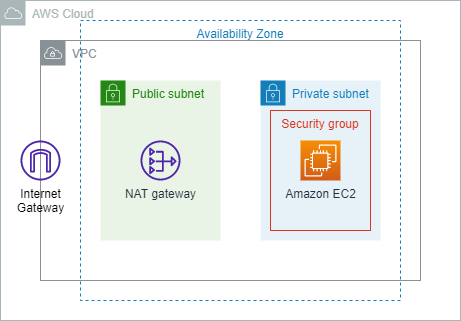

# cloudformation-ec2-operation

## 要件

- EC2をCloudFormationで管理する
- EC2および関連コンポーネントのパラメータシートを自動生成できる
- 開発フローに則った継続的な開発ができる
- 運用フローに則った継続的な運用ができる

## 構成

### 構成図

## 開発・運用

### ブランチ運用

|ブランチ名|説明|備考|
|:--|:--|:--|
|master|いつでもリリース可能なブランチ|デフォルトブランチ|
|develop|作業内容が集約されるブランチ||
|feature/#XXXXX|個人用の作業ブランチ|XXXXXはissue番号|

## コミットメッセージのルール

**issue番号**-**コミットの種類** **内容**  
例) #00000-UPD READMEを追加

### コミットの種類

|コミットの種類|意味|説明|例|
|:--|:--|:--|:--|
|UPD|update|機能追加。仕様の変更を含む機能の更新|ある機能作成におけるpythonファイルの追加|
|FIX|fix|不具合改修。仕様の変更を含まない機能の改修|既存機能におけるパラメータの変更|
|TOL|tool|機能以外の機能の改修|新しいVSCodeExtensionを追加|
|REF|refactoring|リファクタリング|変数名の修正|
|CHR|ミスタイプ修正など軽微な修正|chore|
|DOC|ドキュメントのみの修正|document|

### 運用フロー

作成中
